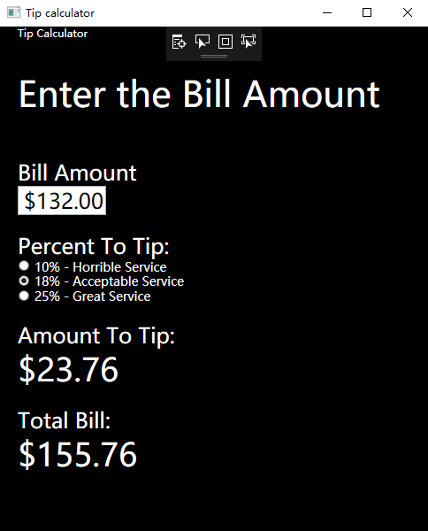

# Tip_Calculator
### 作业要求：
Please build a Desktop WPF APP. for its functions please refer to the viode "ABSWP81Part9_ Tip Calculator_mid.MP4".

### 完成情况：
可以成功运行计算。

### 完成过程：
按照视频敲上代码，但在这过程中出现过一些困难：
 1. 运行过程因为语言为中文导致显示效果出现了问题，后在同学的帮助下成功解决了问题。
 2. 在performCalculation()函数中，因多线程的原因导致SelectRadio为null，在加入一个并判断后，解决了此问题。
